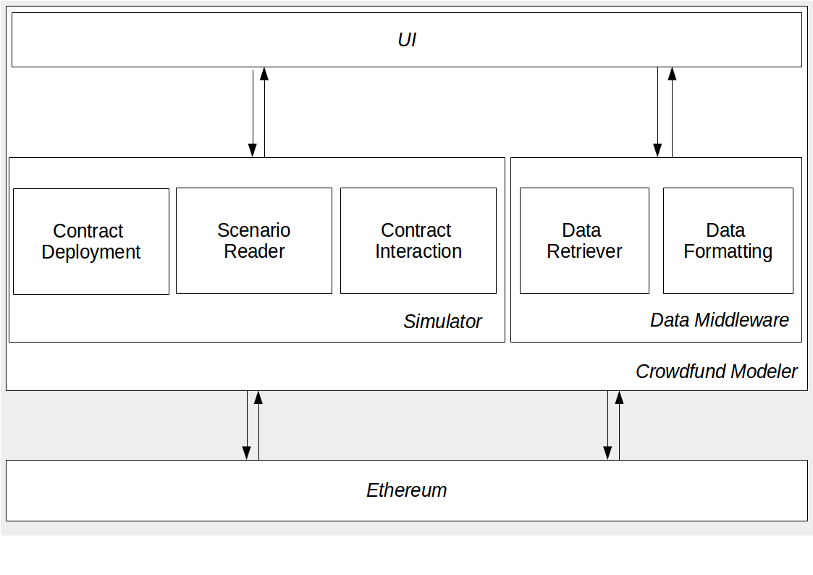

# extropy-crowdfunding-modeler
A tool for modeling the behaviour of different actors during a crowdfunding campaign (ICO)

# Development

## Architectural Overview

A high-level overview of the architecture of the extropy-crowdfunding-modeler can be seen, below, in **Figure 1**.

Figure 1: high-level architectural overview diagram
 

* The **UI** facilitates the user interaction; whether it is the user uploading the contract code to be tested, through to visualising the results for the user.
* The **Simulator** takes care of all of the necessary activities required to simulate one or many crowdfunding scenarios.
* The **Data Middleware** does the heavy lifting of retrieving the results of simulating a crowdfunding from the local Ethereum instance; and performing the aggregation and formatting of the data to make it useful for the UI.